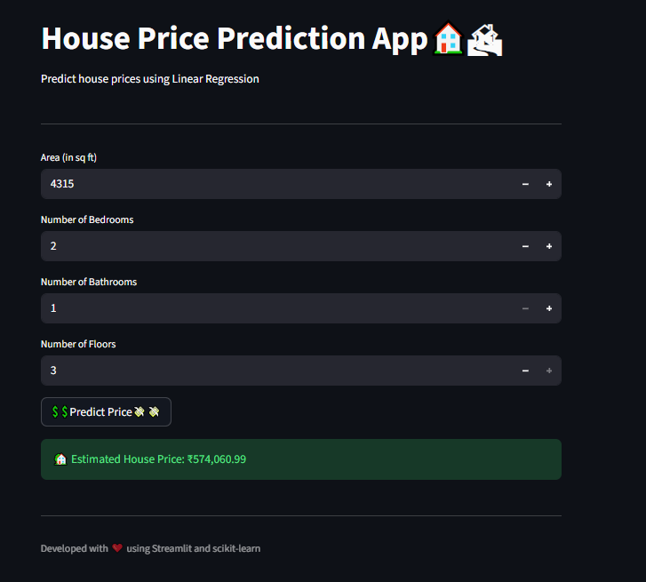

🏠 Simple Linear Regression App

A simple Streamlit web app that predicts house prices based on the size(Area) of the house, number of Bedrooms, Bathroom, Floors using a Linear Regression model built with scikit-learn.

🚀 Features

--> Generates synthetic house data using NumPy.

--> Trains a Linear Regression model to predict prices.

--> Allows users to input various parameters of house for instant prediction.


🧠 Tech Stack

--> Python

--> Streamlit

--> NumPy

--> Pandas

--> Scikit-learn

▶️ How to Run

**Clone this repository:**
```bash
git clone https://github.com/johan621/linear-regression-app.git
cd linear-regression-app

```
**Install dependencies:**
```bash
pip install -r requirements.txt

```
**Run the app:**
``bash
streamlit run app.py
``

Open the local URL shown in the terminal.

**📊 Output Example**

**DEMO Image**

<p align="center">
  
</p>
